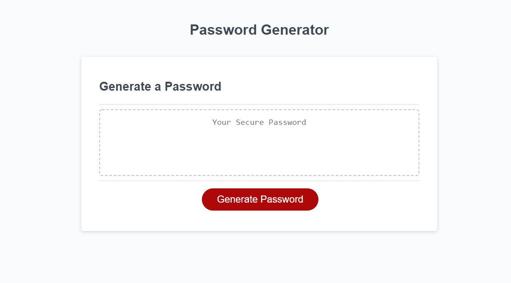
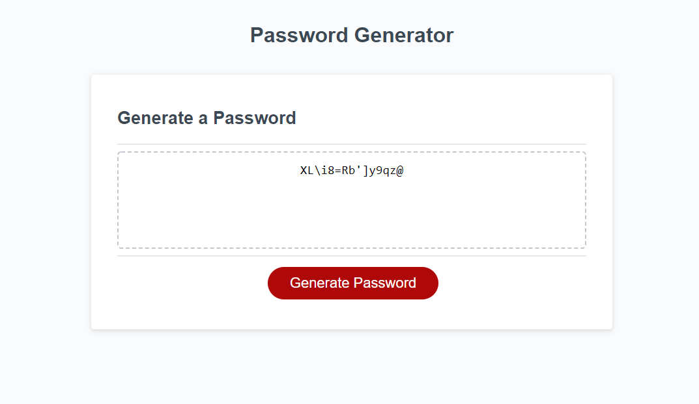

# JavaScript: Password Generator

## Purpose

The Purpose of this project was to modify existing code provided by the course material to create a random password generator. This generator allows the user to customize the desired password through a series of options. 

The customizable options of the generator are:
- The user can select a password length between 8 and 128 characters. If an invalid length is entered they are prompted to try again. 
- The user can select which of the following character sets they wish to include. If no character set is selected the user is promped to try again.
    - Lowercase letters
    - Uppercase letters
    - Special characters
    - Numbers

The site can be found at: https://jpolmon.github.io/PWGenHW03/

---
## Appearance

### When visited the site should appear as:  

### An example of a 15-character generated password with all characters selected:

